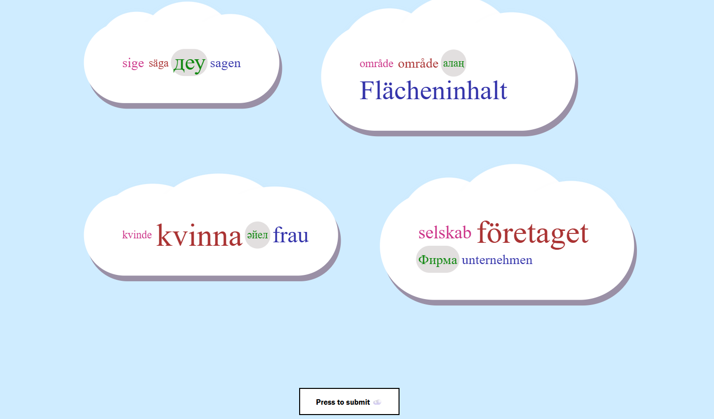
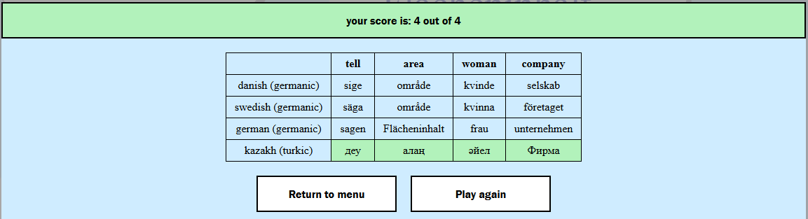
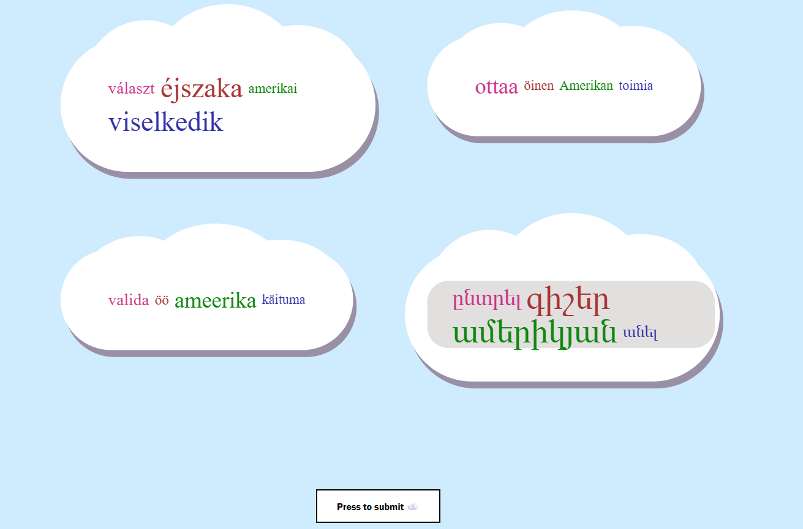
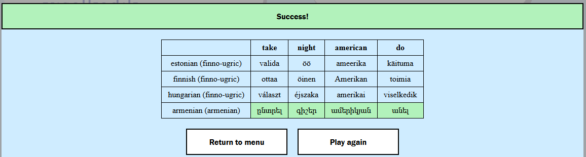

# A-Sky-of-Word-Clouds
A fun guessing game where you have to find the impostor amongst the words!

---
[Click here to play!](https://fishm4n.pythonanywhere.com/)
---
## The Idea
The idea was to create a guessing game that introduces the player to the world’s linguistic diversity in a fun and visually appealing way. By presenting a wide variety of languages of many different language families and written in many 
different scripts, the player explores the similarities and differences within and across the 
boundaries of language families.

The basic layout of the game consists of sixteen words – the same four words in four different languages – 
being assembled into four word clouds. The assembling can happen in two ways, depending on the chosen 
game mode: one cloud per word (game mode 1), or one cloud per language (game mode 2). In either case, three out of the four languages are always from the same language family, while one is not.  

The player’s task is to find the words in the language that does not belong to the same language family as the 
other three (referred to as the "odd" language/word).

## Demo
In game mode 1, all the words in a given cloud mean the same thing. The goal is to find the odd word in each cloud. Note that in the easy difficulty level illustrated here, the languages are coloured coded, e.g., all Kazakh words are green. One odd word found therefore implies the missing three. This is not the case in the hard difficulty level.

After submitting the answer, a 4x4 grid will appear with the answers, illustrating the correct answers in **green**, and the wrong ones in **red**.

In game mode 2, as the words are grouped by language, the odd cloud has to be found. Once again, easy means colour-coding: same colour = same meaning. This additional cue is not present in the hard difficulty level.

Analogously to game mode 1, the answer grid will be displayed upon submitting.

---
Language Technology and Web Applications  
University of Zurich, Autumn Semester 2022
